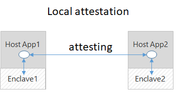
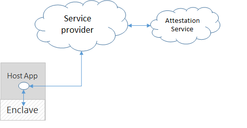
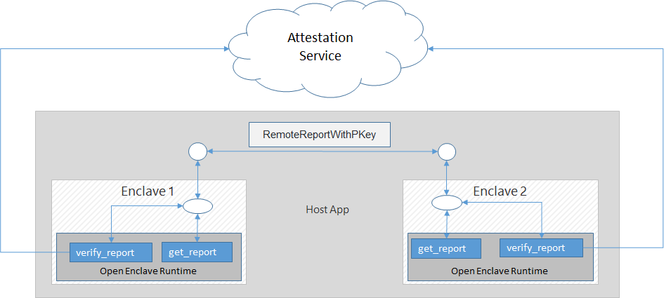

# The Remote Attestation Sample

This sample demonstrates how to do remote attestation between two enclaves.

It has the following properties:

- Written in C++
- Demonstrates an implementation of remote attestation
- Use of mbedTLS within the enclave
- Use Asymmetric / Public-Key Encryption to establish secure communications between two attesting enclaves
- Enclave APIs used:
  - oe_get_report
  - oe_verify_report,
  - oe_is_within_enclave

**Note: Currently this sample only works on SGX-FLC systems.** The underlying SGX library support for end-to-end remote attestation is available only on SGX-FLC system. There is no plan to back port those libraries to either SGX1 system or software emulator.

## Attestation primer

### What is Attestation

Attestation is the process of demonstrating that a software component (such as an enclave image) has been properly instantiated on an Trusted Execution Environment (TEE, such as the SGX enabled platform).

A successfully attested enclave proves:

- The enclave is running in a valid Trusted Execution Environment (TEE), which is Intel SGX in this case (trustworthiness).

- The enclave has the correct identity and runtime properties that has not been tampered with (identity).

  In the context of Open Enclave, when an enclave requests confidential information from a remote entity, the remote entity will issue a challenge to the requesting enclave to prove its identity and trustworthiness before provisioning any confidential information to the enclave. This process of proving its identity and trustworthiness to a challenger is known as attestation.

### Attestation types

There are two types of attestation:

- **Local Attestation** refers to two enclaves on the same TEE platform authenticating each other before exchanging information. In Open Enclave, this is done through the creation and validation of an enclave's `local report`.

  

- **Remote Attestation** is the process of a [trusted computing base (TCB)](https://en.wikipedia.org/wiki/Trusted_computing_base), a combination of HW and SW, gaining the trust of a remote enclave/provider. In Open Enclave, this is done through the creation and validation of an enclave's `remote report`.

  

### Secure Communication Channel

Remote Attestation alone is not enough for the remote party to be able to securely deliver their secrets to the requesting enclave. Securely delivering services requires a secure communication channel which is often guaranteed by Transport Layer Security (TLS). Using Asymmetric/Public-Key encryption in conjunction with generating a symmetric key based on the sealing key provides an alternate mechanism for establishing such a non-TLS channel.

In this remote attestation sample, it demonstrates a way to embed public keys in the remote attestation process to help establish a secure communication channel right after the attestation is done.

Here is a good article about [Intel SGX attestation](
https://software.intel.com/sites/default/files/managed/57/0e/ww10-2016-sgx-provisioning-and-attestation-final.pdf), which describes how Intel's SGX attestation works. The current Open Enclave's implementation was based on it for the SGX platform.

Note: `local report` is the same as an `Intel SGX report`, while the `remote report` is the same as an `Intel SGX quote`.

## Remote Attestation sample

In a typical Open Enclave application, it's common to see multiple enclaves working together to achieve common goals. Once an enclave verifies the counterpart is trustworthy, they can exchange information on a protected channel, which typically provides confidentiality, integrity and replay protection.

This is why instead of attesting an enclave to a remote (mostly cloud) service, this sample demonstrates how to attest two enclaves to each other by using Open Enclave APIs `oe_get_report` and `oe_verify_report` which takes care of all remote attestation operations.

To simplify this sample without losing the focus in explaining how the remote attestation works, host1 and host2 are combined into one single host to eliminate the need for additional socket code logic to deal with communication between two hosts.


### Authoring the Host

The host process is what drives the enclave app. It is responsible for managing the lifetime of the enclave and invoking enclave ECALLs but should be considered an untrusted component that is never allowed to handle plaintext secrets intended for the enclave.



The host does the following in this sample:

   1. Create two enclaves for attesting each other, let's say they are enclave_a and enclave_b

      ```c
      oe_create_proprietarysecurechannel_enclave( enclaveImagePath, OE_ENCLAVE_TYPE_SGX, OE_ENCLAVE_FLAG_DEBUG, NULL, 0, &enclave);
      ```

   2. Ask enclave_a for a remote report and a public key, which is returned in a `RemoteReportWithPKey` structure.

      This is done through a call into the enclave_a `GetRemoteReportWithPKey` `OE_ECALL`

      ```c
      oe_call_enclave(enclave, "GetRemoteReportWithPKey", &args);

      struct RemoteReportWithPKey
      {
          uint8_t pem_key[512]; // public key information
          uint8_t* remote_report;
          size_t remote_report_size;
      };
      ```

      Where:

        - `pem_key` holds the public key that identifies enclave_a and will be used for establishing a secure communication channel between the enclave_a and the enclave_b once the attestation is done.

        - `remote_report` contains a remote report signed by the enclave platform for use in remote attestation

   3. Ask enclave_b to attest (validate) enclave_a's remote report (remote_report from above)

      This is done through the following call:
      ```c
      oe_call_enclave(enclave, "VerifyReportAndSetPKey", &args);
      ```

      In the enclave_b's implmentation of `VerifyReportAndSetPKey`, it calls `oe_verify_report`, which will be described in the enclave section to handle all the platform specfic report validation operations (including PCK certificate chain checking). If successful the public key in `RemoteReportWithPKey.pem_key` will be stored inside the enclave for future use

   4. Repeat step 2 and 3 for asking enclave_a to validate enclave_b
  
   5. After both enclaves successfully attest each other, use Asymmetric/Public-Key Encryption followed by the alternate implementation to establish secure communications between the two attesting enclaves.
  
      The fact that each enclave has the other enclave's public key makes it possible to establish a secure communication channel.
  
   6. Send encrypted messages securely between enclaves

      ```c
      // Ask enclave_a to encrypt an internal data with its private key and output encrypted message in encrypted_msg
      generate_encrypted_message(enclave_a, &encrypted_msg, &encrypted_msg_size);

      // Send encrypted_msg to the enclave_b, which will decrypt it and comparing with its internal data,
      // In this sample, it starts both enclaves with the exact same data contents for the purpose of
      // demonstrating that the encryption works as expected
      process_encrypted_msg(enclave_b, encrypted_msg, encrypted_msg_size);
      ```

   7. Free the resource used, including the host memory allocated by the enclaves and the enclaves themselves
  
      For example:

      ```c
      oe_terminate_enclave(enclave_a);
      oe_terminate_enclave(enclave_b);
      ```

### Authoring the Enclave

#### Attesting an Enclave

Attesting an enclave consists of three steps:

##### 1) Generating an Enclave Report

The enclave being attested first needs to generate a cryptographically strong proof of its identity that the challenger can verify. In the sample this is done by asking the SGX platform to generate a `remote report` signed by Intel via the `oe_get_report` method with `OE_REPORT_FLAGS_REMOTE_ATTESTATION` flag. The `remote report` can be verified by the `oe_verify_report` method on a different machine.

An important feature of `oe_get_report` is that you can pass in application specific data as the `reportData` parameter to be signed into the report.

- This is limited to 64 bytes in SGX. As illustrated in the sample, you sign arbitrarily large data into the report by first hashing it and then passing it to the `oe_get_report` method.

- This is useful to bootstrap a secure communication channel between the enclave and the challenger.

  - In this sample, the enclave signs the hash of an ephemeral public key into its report, which the challenger can then use to encrypt a response to it.

  - Other usage examples for `reportData` might be to include a nonce, or to initiate Diffie-Helman key exchange.

##### 2) Verifying the integrity of the Enclave Report

Once the report is generated and passed to the challenger, the challenger can call `oe_verify_report` to validate the report originated from an Trust Execution Environment (TEE, in the case it's a valid SGX platform).

In the context of Open Enclave on Intel SGX platform, a remote report is verified using the certificate chain issued by Intel which is only valid for SGX platforms.

At this point, the challenger knows that the report originated from an enclave running in a TEE, and that the information in the report can be trusted.

Note that for the Public Preview, remote attestation verification is only supported in the Azure ACC VMs, but Intel will be expanding support for this with Open Enclave SDK more broadly moving forwards.

##### 3) Verifying the enclave identity

Finally, it is up to the enclave app to check that identity and properties of the enclave reflected in the report matches its expectation.
Open Enclave exposes a generalized identity model to support this process across TEE types. In the sample, the app-specific `AttestQuote` method calls `oe_parse_report` to obtain an `oe_report_t`. This data structure surfaces:

- The `reportData` signed into the report
- The generalized identity structure as defined by `oe_identity_t`:

  ```c
  typedef struct _oe_identity
  {
      /** Version of the oe_identity_t structure */
      uint32_t idVersion;

      /** Security version of the enclave. For SGX enclaves, this is the
        *  ISVN value */
      uint32_t securityVersion;

      /** Values of the attributes flags for the enclave -
        *  OE_REPORT_ATTRIBUTES_DEBUG: The report is for a debug enclave.
        *  OE_REPORT_ATTRIBUTES_REMOTE: The report can be used for remote
        *  attestation */
      uint64_t attributes;

      /** The unique ID for the enclave.
        * For SGX enclaves, this is the MRENCLAVE value */
      uint8_t uniqueID[OE_UNIQUE_ID_SIZE];

      /** The author ID for the enclave.
        * For SGX enclaves, this is the MRSIGNER value */
      uint8_t authorID[OE_AUTHOR_ID_SIZE];

      /** The Product ID for the enclave.
        * For SGX enclaves, this is the ISVPRODID value. */
      uint8_t productID[OE_PRODUCT_ID_SIZE];
  } oe_identity_t;
  ```

As shown in the sample, the set of validations performed on these properties is up to the app. In general, we would strongly recommend:

- Ensure that the identity of the enclave matches the expected value:
  - Verify the `uniqueID` value if you want to match the exact bitwise identity of the enclave. Bear in mind that any patches to the enclave will change the uniqueID in the future.
  - Verify the `authorID` and `productID` values if you want to match the identity of an enclave that might span multiple binary versions. This is what the attestation sample does.  
- Ensure that the `securityVersion` of the enclave matches your minimum required security version.
- Ensure that the `reportData` matches the hash of the data provided with the report, as illustrated by the sample.

## Using Cryptography in an Enclave

The attestation proprietary_secure_channel/common/crypto.cpp file from the sample illustrates how to use mbedTLS inside the enclave for cryptographic operations such as:

- RSA key generation, encryption and decryption
- SHA256 hashing

In general, the Open Enclave SDK provides default support for mbedTLS layered on top of the Open Enclave core runtime with a small integration surface so that it can be switched out by open source developers in the future for your choice of crypto libraries.

See [here](https://github.com/Microsoft/openenclave/tree/master/docs/MbedtlsSupport.md) for supported mbedTLS functions

## Build and run

Note that there are two different build systems supported, one using GNU Make and
`pkg-config`, the other using CMake.

### CMake

This uses the CMake package provided by the Open Enclave SDK.

```bash
cd proprietary_secure_channel
mkdir build && cd build
cmake ..
make run
```

### GNU Make

```bash
cd proprietary_secure_channel
make build
make run
```
